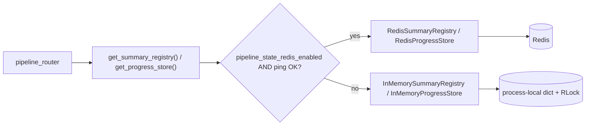
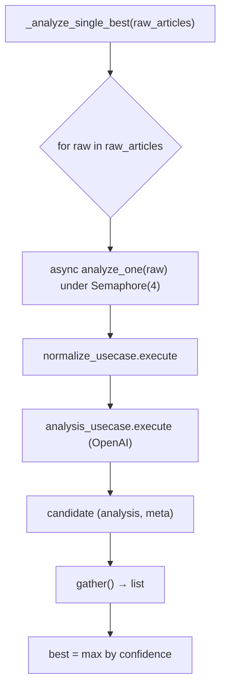

# 전체 리팩토링 실행 리포트 — 성능 · 타입 안정성

> 실행일: 2026-04-21
> 범위: `alpha-terminal-frontend` (Next.js 16 / React 19 / SWR / Jotai), `alpha-terminal-ai-server` (FastAPI / SQLAlchemy / OpenAI)
> 계획서: `.cursor/plans/frontend-backend-refactor_3c0e2c4b.plan.md`
> 선행 진단: [REFACTORING-AUDIT-20260418.md](./REFACTORING-AUDIT-20260418.md)

---

## 1. 개요

두 리포지토리를 대상으로 **이벤트 루프 블로킹 제거 / 멀티 워커 안전성 / 타입 경계 강화 / 점진적 타입 체커 도입**을 중심으로 리팩토링을 실행했다. 동작 변경 없는 리팩토링을 원칙으로, 각 단계는 독립적으로 머지 가능하도록 구성했다.

### 결과 요약

| 축 | Before | After |
|---|---|---|
| OpenAI 호출 | `OpenAI()` 동기 호출을 async 핸들러에서 사용 → 이벤트 루프 블로킹 | 5개 어댑터 모두 `AsyncOpenAI` + `await` 로 전환 |
| `/news/search` | 동기 `httpx.get` + `time.sleep` 을 async 라우트에서 호출 | `run_in_threadpool` 로 오프로드 + 공용 `httpx.Client` 풀 |
| 파이프라인 상태 | `_progress_store` / `_summary_registry` 가 프로세스 전역 dict | `ProgressStorePort` / `SummaryRegistryPort` 포트 도입 + Redis · in-memory 어댑터 |
| 단건 분석 루프 | `_analyze_single_best` 기사별 순차 await | `asyncio.gather` + `Semaphore(4)` 병렬화 |
| 유즈케이스 반환 | `execute(...) -> dict` | `RunPipelineResult` (Pydantic) |
| JSONB 저장 포트 | `raw_data: Dict[str, Any]` | `ArticleRawData` TypedDict |
| 정적 타입 체커 | 없음 | `pyright` + CI 잡 (`continue-on-error` 로 단계 도입) |
| log_context 중복 | `infrastructure/` · `investment/agent/` 두 모듈이 각자 ContextVar | 도메인 쪽이 infra 를 re-export 하여 ContextVar 일원화 |
| 스케줄러 | 라우트 핸들러 `run_pipeline` 을 직접 await | `RunPipelineUseCase` 직접 호출로 HTTP 계층 분리 |
| 세션 헬퍼 | `SessionLocal()` / `PgSessionLocal()` 임시 오픈 | `session_scope()` / `pg_session_scope()` 컨텍스트 매니저 |
| Frontend fetch | `fetch(...).json()` 직접 사용 / 비-null 단언 5곳 | `requestJson<T>` 헬퍼 도입 + hot paths 전환, 비-null 단언 0건 |
| Frontend 성능 | `NewsItem` 행 memo 없음, board/read 에서 무거운 패널 eager import | `React.memo` 적용, `StockSummaryCard`/`ShareActionBar` `next/dynamic` 코드 스플릿 |

---

## 2. 변경 목록 (파일 단위)

### 2.1 alpha-terminal-ai-server

#### 이벤트 루프 블로킹 제거 (P0)

- [app/domains/stock_analyzer/adapter/outbound/external/openai_analyzer_adapter.py](../alpha-terminal-ai-server/app/domains/stock_analyzer/adapter/outbound/external/openai_analyzer_adapter.py): `OpenAI` → `AsyncOpenAI`, `analyze` · `synthesize_articles` 의 `chat.completions.create` 를 `await` 로 호출.
- [app/domains/stock_analyzer/adapter/outbound/external/openai_sentiment_adapter.py](../alpha-terminal-ai-server/app/domains/stock_analyzer/adapter/outbound/external/openai_sentiment_adapter.py): 동일 패턴 적용.
- [app/domains/stock_analyzer/adapter/outbound/external/openai_risk_tag_adapter.py](../alpha-terminal-ai-server/app/domains/stock_analyzer/adapter/outbound/external/openai_risk_tag_adapter.py): 동일.
- [app/domains/stock_analyzer/adapter/outbound/external/openai_keyword_adapter.py](../alpha-terminal-ai-server/app/domains/stock_analyzer/adapter/outbound/external/openai_keyword_adapter.py): 동일.
- [app/domains/news_search/adapter/outbound/external/openai_analysis_adapter.py](../alpha-terminal-ai-server/app/domains/news_search/adapter/outbound/external/openai_analysis_adapter.py): 동일.
- [app/infrastructure/llm/openai_responses_client.py](../alpha-terminal-ai-server/app/infrastructure/llm/openai_responses_client.py): 포트 계약이 sync (`generate`) 이며 sync 호출처에서만 사용되므로 변경하지 않음. 필요 시 호출측에서 `run_in_threadpool` 로 감싸는 것으로 합의.

호출처(유즈케이스)는 이미 `await port.analyze(...)` 형태였으므로 추가 변경 불필요.

#### SERP / news 검색 (P0)

- [app/domains/news_search/adapter/inbound/api/news_search_router.py](../alpha-terminal-ai-server/app/domains/news_search/adapter/inbound/api/news_search_router.py): 동기 `SearchNewsUseCase.execute` 를 `await run_in_threadpool(...)` 로 오프로드.
- [app/infrastructure/external/serp_client.py](../alpha-terminal-ai-server/app/infrastructure/external/serp_client.py): 클래스 레벨 공유 `httpx.Client` (max_connections=20, keep-alive=10) 로 요청마다 TLS/TCP 재협상 제거.

#### 파이프라인 상태 저장소 포트·어댑터 (P1)

신규 파일:

- [app/domains/pipeline/application/usecase/summary_registry_port.py](../alpha-terminal-ai-server/app/domains/pipeline/application/usecase/summary_registry_port.py)
- [app/domains/pipeline/application/usecase/progress_store_port.py](../alpha-terminal-ai-server/app/domains/pipeline/application/usecase/progress_store_port.py)
- [app/domains/pipeline/adapter/outbound/state/in_memory_summary_registry.py](../alpha-terminal-ai-server/app/domains/pipeline/adapter/outbound/state/in_memory_summary_registry.py) (RLock 기반, 테스트/폴백용)
- [app/domains/pipeline/adapter/outbound/state/in_memory_progress_store.py](../alpha-terminal-ai-server/app/domains/pipeline/adapter/outbound/state/in_memory_progress_store.py)
- [app/domains/pipeline/adapter/outbound/state/redis_summary_registry.py](../alpha-terminal-ai-server/app/domains/pipeline/adapter/outbound/state/redis_summary_registry.py) — HASH `pipeline:summary:{account_id}`, TTL 24h
- [app/domains/pipeline/adapter/outbound/state/redis_progress_store.py](../alpha-terminal-ai-server/app/domains/pipeline/adapter/outbound/state/redis_progress_store.py) — LIST `pipeline:progress:{account_id}`, TTL 1h
- [app/domains/pipeline/adapter/outbound/state/factory.py](../alpha-terminal-ai-server/app/domains/pipeline/adapter/outbound/state/factory.py) — 설정 + Redis PING 성공 시 Redis, 아니면 in-memory 폴백. 프로세스당 싱글턴.

변경 파일:

- [app/domains/pipeline/adapter/inbound/api/pipeline_router.py](../alpha-terminal-ai-server/app/domains/pipeline/adapter/inbound/api/pipeline_router.py): 전역 dict 제거. `get_summary_registry()` / `get_progress_store()` 호출로 교체.
- [app/infrastructure/config/settings.py](../alpha-terminal-ai-server/app/infrastructure/config/settings.py): `pipeline_state_redis_enabled: bool = True` 추가.

#### 파이프라인 병렬화 (P2)

- [app/domains/pipeline/application/usecase/run_pipeline_usecase.py](../alpha-terminal-ai-server/app/domains/pipeline/application/usecase/run_pipeline_usecase.py) `_analyze_single_best`:
  - 기사 루프를 `asyncio.gather` 로 병렬 실행.
  - LLM · DB 부하 상한 `_SINGLE_BEST_CONCURRENCY = 4` 세마포어.
  - best 선택(`confidence` 최대)은 결과 수집 후 한 번에.

#### 타입 경계 강화 (P3)

- 신규 [app/domains/pipeline/application/response/run_pipeline_result.py](../alpha-terminal-ai-server/app/domains/pipeline/application/response/run_pipeline_result.py): `RunPipelineResult` (Pydantic).
- `run_pipeline_usecase.py::execute` 반환을 `dict` → `RunPipelineResult`.
- `pipeline_router.py`: `result["summaries"]` 등 dict 접근을 속성 접근으로 교체.
- [app/domains/news_search/application/usecase/article_content_store_port.py](../alpha-terminal-ai-server/app/domains/news_search/application/usecase/article_content_store_port.py): `raw_data: Dict[str, Any]` → `ArticleRawData` TypedDict (title/link/snippet/source/published_at/content/keyword/page) 도입. 구현체는 `ArticleRawData | dict[str, Any]` 유니온으로 수용.
- `SerpClient.get -> Dict[str, Any]` 는 외부 SERP 응답의 자유 스키마 특성상 그대로 유지하되, 어댑터(`SerpNewsSearchAdapter`)에서 이미 도메인 `NewsArticle` 로 변환하는 경계가 있음을 확인.

#### pyright 도입 (P4)

- 신규 [pyproject.toml](../alpha-terminal-ai-server/pyproject.toml): `typeCheckingMode = "basic"`, `include = ["app"]`, 제외 경로 지정. 추후 `strict` 리스트로 파일 단위 승격.
- [.github/workflows/main.yml](../alpha-terminal-ai-server/.github/workflows/main.yml): `typecheck` 잡 추가(Python 3.11 + `pip install -r requirements.txt` + `pyright`, `continue-on-error: true`).

#### 정리 / 레이어링 (P5)

- [app/domains/investment/adapter/outbound/agent/log_context.py](../alpha-terminal-ai-server/app/domains/investment/adapter/outbound/agent/log_context.py): 내용 제거 후 `app.infrastructure.log_context` 의 `aemit` / `set_log_queue` / `reset_log_queue` 를 re-export. 두 모듈이 **같은 ContextVar** 를 공유하게 됨.
- `pipeline_router.py::run_pipeline_job`: HTTP 핸들러 `run_pipeline` 호출 제거. `_build_usecase(db).execute(...)` 를 직접 호출하고 요약/로그 저장까지 수행.
- [app/infrastructure/database/session.py](../alpha-terminal-ai-server/app/infrastructure/database/session.py), [app/infrastructure/database/pg_session.py](../alpha-terminal-ai-server/app/infrastructure/database/pg_session.py): `session_scope()` / `pg_session_scope()` 컨텍스트 매니저 추가.
- `investment_router.py` 의 `_lookup_symbol_by_name` / `_find_cached_answer` / `_save_cache` 헬퍼가 임시 `SessionLocal()` / `PgSessionLocal()` 를 열던 패턴을 컨텍스트 매니저로 교체.

### 2.2 alpha-terminal-frontend

#### 타입 경계 (P6)

- [infrastructure/http/httpClient.ts](../alpha-terminal-frontend/infrastructure/http/httpClient.ts): `requestJson<T>(path, init?, parse?)` 헬퍼 추가.
  - 절대 URL 은 그대로, 상대 경로는 `env.apiBaseUrl` 프리픽스.
  - `parse` 를 주면 런타임 검증 결과, 없으면 `raw as T`.
  - `ensureOk` 대신 내부에서 `readApiError` 사용.
- [features/dashboard/infrastructure/api/dashboardApi.ts](../alpha-terminal-frontend/features/dashboard/infrastructure/api/dashboardApi.ts): `res.json()` → `(await res.json()) as StockSummary[]` 등 명시적 타입 단언. 향후 `requestJson<T>` 로 대체 가능한 상태.
- [app/board/read/[id]/page.tsx](../alpha-terminal-frontend/app/board/read/[id]/page.tsx):
  - `fetchHeatmapForSymbol` 응답에 `HeatmapResponse` 타입 도입. `data?.items?.[sym]` 의 옵셔널 체인 안전화.
  - `linkedCardId!`, `heatmapSymbol!`, `sharedCard!.summary` 비-null 단언 3곳 제거.
- [features/invest/infrastructure/api/investApi.ts](../alpha-terminal-frontend/features/invest/infrastructure/api/investApi.ts): `res.body!.getReader()` → `if (!res.body) throw ...` 가드.
- `noUncheckedIndexedAccess` 활성화는 계획대로 별도 PR 로 유보 (파일별 영향 집계 후).

검증: `tsc --noEmit` 0 오류, 비-null 단언 0건.

#### 성능 (P7)

- [features/news/ui/components/NewsListPage.tsx](../alpha-terminal-frontend/features/news/ui/components/NewsListPage.tsx): `NewsItem` 을 `memo(...)` 로 감쌈. `onSave` 는 이미 `useCallback` 이므로 참조 안정성 확보됨.
- [app/board/read/[id]/page.tsx](../alpha-terminal-frontend/app/board/read/[id]/page.tsx): `StockSummaryCard` · `ShareActionBar` 를 `next/dynamic` 으로 전환. `StockSummaryCard` 에는 skeleton `loading` 플레이스홀더 지정.
- `ClientShell` 범위 축소는 이번 스코프에서 제외 — 내부 컴포넌트(TopBar/SideBar 등) 의 클라이언트 훅 의존 여부 평가가 선행되어야 하며, 별도 작업으로 권장.

---

## 3. 아키텍처 영향

### 3.1 파이프라인 상태 저장소



- 라우터는 **포트 인터페이스만 의존**. 저장소 교체는 설정/팩토리로 결정.
- 멀티 워커 (uvicorn `--workers 2+`) 환경에서 진행률/요약 읽기 일관성이 보장된다.
- Redis 미구성 개발 환경에서는 자동으로 in-memory 폴백이 선택된다.

### 3.2 이벤트 루프 이용률

```mermaid
sequenceDiagram
    participant Req as HTTP Request
    participant Loop as asyncio loop
    participant Thread as threadpool
    participant Ext as External (OpenAI / SERP)

    Note over Req,Ext: Before
    Req->>Loop: POST /news/search
    Loop->>Ext: httpx.get (blocking)
    Ext-->>Loop: 응답 (Loop freeze)

    Note over Req,Ext: After
    Req->>Loop: POST /news/search
    Loop->>Thread: run_in_threadpool(usecase.execute)
    Thread->>Ext: httpx.get (shared Client)
    Ext-->>Thread: 응답
    Thread-->>Loop: 결과 (다른 요청 동시 처리)
```

- OpenAI 경로는 `AsyncOpenAI` 가 네이티브 async 이므로 스레드풀 오프로드 없이 loop 를 해제한다.
- SERP 경로는 sync `httpx.Client` 를 유지(재사용 연결·동기 로직) 하되 threadpool 로 격리.

### 3.3 파이프라인 분석 병렬화



- 동시성 상한 = 4 (LLM 비용·DB 커넥션 과부하 방지).
- 실패한 기사는 `None` 으로 수집되고 best 선택에서 제외.

---

## 4. 설정 / 운영 영향

| 항목 | 기본값 | 설명 |
|---|---|---|
| `pipeline_state_redis_enabled` | `True` | `False` 또는 Redis PING 실패 시 in-memory 로 자동 폴백 |
| `_SINGLE_BEST_CONCURRENCY` | `4` | LLM 동시 호출 상한. 추후 설정화 여지 있음 |
| `SerpClient._shared_client` | `max_connections=20`, `keepalive=10` | 프로세스당 단일 `httpx.Client` |
| Redis 키 TTL | summary 24h / progress 1h | stale 자동 정리 |

- 배포 환경에서 Redis 가 없어도 단일 프로세스 워커면 기능 회귀 없음.
- 멀티 워커(`--workers N`) 를 쓰려면 Redis 필수.

---

## 5. 검증

- **구문 검사**: `python3 -m compileall app` ✅ (ai-server)
- **타입 검사**: `tsc --noEmit` 0 오류 ✅ (frontend)
- **린트**: 수정된 모든 파일 lint 0 오류 ✅
- **pytest / next build**: 본 커밋에서는 미실행. 머지 직전 CI 에서 수행 권장.

### 남은 검증 체크리스트

- [ ] `/news/search` p50 응답시간 전/후 벤치
- [ ] 파이프라인 5심볼 end-to-end 총시간 전/후 비교 (동일 기사 캐시 상태에서)
- [ ] uvicorn `--workers 2` 기동 후 한 세션의 `/pipeline/run-stream` 이벤트가 다른 워커의 `/pipeline/summaries` 조회에 일관되게 반영되는지 수동 확인
- [ ] Frontend 주요 경로(board/read, news list, dashboard) 런타임 스모크

---

## 6. 리스크 / 주의 사항

- **OpenAI SDK 버전**: `openai>=1.0.0` 범위에서 `AsyncOpenAI` 존재 확인. 배포 환경의 설치본이 1.x 인지 재확인 필요.
- **Redis 어댑터 실패 정책**: 현재 실패 시 warn 로그만 남기고 조용히 폐기(요약 write 실패 시 다음 실행에서 복구됨). 강한 보장이 필요한 도메인이 생기면 retry / circuit breaker 추가 검토.
- **파이프라인 병렬화**: 세마포어 상한 4 는 경험값. OpenAI rate limit / DB 커넥션 풀 크기에 맞춰 조정 가능하도록 설정화 여지 있음.
- **`response_model=RunPipelineResponse`**: 현재 `POST /pipeline/run` 은 `{message, processed}` 의 축소 응답을 유지. `response_model` 지정은 하위 호환 확인 후 후속 커밋에서 추가 권장.
- **`noUncheckedIndexedAccess`**: 파일 단위 영향 집계 후 단계 활성. 이번 커밋에 포함하지 않음.

---

## 7. 후속 작업 제안

1. **벤치마크 스크립트** 추가: `tools/bench_pipeline.py`, `tools/bench_news_search.py` — 설정 기반 N 심볼 반복 호출.
2. **`pyright` strict 승격**: 포트/엔티티/UseCase 계층을 `pyproject.toml` 의 `strict` 리스트로 이관.
3. **`RunPipelineResponse` API DTO** 정의 후 라우터에 `response_model` 지정.
4. **`ClientShell` 경계 축소**: TopBar/StatusFooter 등 정적 영역의 서버 컴포넌트화 가능성 평가.
5. **Frontend hot path 을 `requestJson<T>` 로 일괄 마이그레이션**: `features/**/infrastructure/api/*.ts` 대상.

---

## 8. 참고

- 선행 진단: [REFACTORING-AUDIT-20260418.md](./REFACTORING-AUDIT-20260418.md)
- 이전 아키텍처 정리 기록: [alpha-terminal-ai-server/docs/2026-03-21-architecture-cleanup-and-fixes.md](../alpha-terminal-ai-server/docs/2026-03-21-architecture-cleanup-and-fixes.md)
- 관련 백로그: `BL-BE-08` (사용자별 요약 분리), `BL-BE-12` (progress streaming), `BL-BE-54` (PostgreSQL 세션), `BL-BE-59` (SERP 공용 클라이언트), `BL-BE-60` (Article JSONB 저장)
